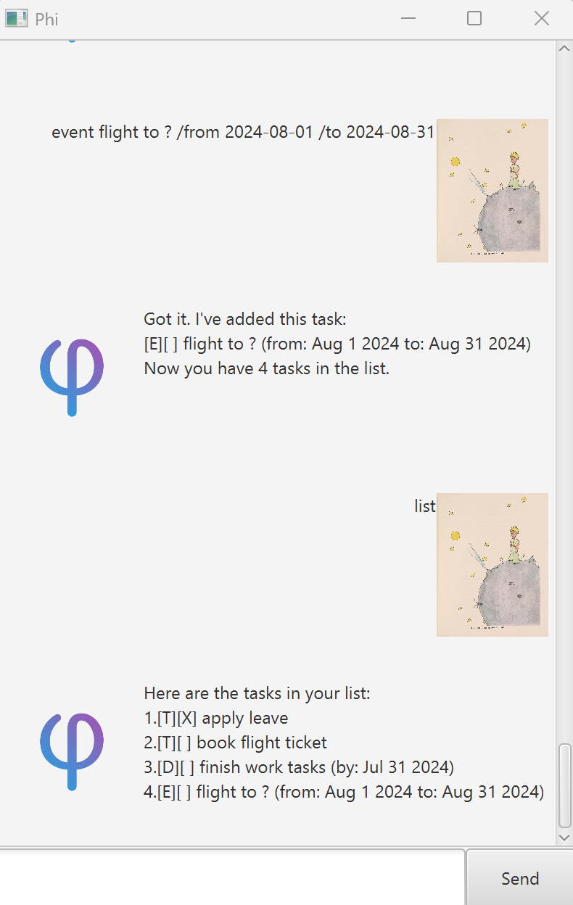

# Phi User Guide
***
Welcome to Phi, **THE** platform to bring structure to your life!




# Features
***

### Part A: Adding Tasks
Phi allows us to keep track of the 3 main types of tasks in our lives: 
tasks with a deadline **(deadline)**, tasks which involve 
attending a function **(event)** and tasks without a deadline **(todo)**.


### 1. Add a 'deadline' task
***
To add a 'deadline' task, use the ```deadline``` command followed by 
the task description and the due date (format: yyyy-mm-dd).

**Format:** ```deadline [task description] /by [due date in required format]```

**Example:**
- ```deadline finish work tasks /by 2024-07-31```

Sample output:
```
Got it. I've added this task:
    [D][ ] finish work tasks (by: Jul 31 2024)
Now you have 1 task in the list.
```

### 2. Add an 'event' task
***
To add an 'event' task, use the ```event``` command followed by the task description, 
event start date (format: yyyy-mm-dd) and event end date (format: yyyy-mm-dd).

**Format:** ```event [task description] /from [start date] /to [end date]```

**Example:**
- ```flight to ? /from 2024-08-01 /to 2024-08-31```

Sample output:
```
Got it. I've added this task:
    [E][ ] flight to ? (from: Aug 1 2024 to: Aug 31 2024)
Now you have 1 task in the list.
```

### 3. Add a 'todo' task
***
To add a 'todo' task, use the ```todo``` command followed by the task description.

**Format:** ```todo [task description]```

**Examples:**
- ```todo apply leave```
- ```todo book flight ticket```

Sample output:
```
Got it. I've added this task:
    [T][ ] book flight ticket
Now you have 1 task in the list.
```

### Part B: Removing Tasks
Phi allows us to remove tasks which might no longer 
be relevant to our lives.

### 4. Delete a task
***
To delete a task of any type, use the ```delete``` command followed by the task number.

**Format:** ```delete [task number]```

**Example:**
- ```delete 1```: delete the 1st task on the list

Sample Output:
```
Noted. I've removed this task:
    [T][X] apply leave
Now you have 3 tasks in the list.
```

### Part C: Additional Features
Phi offers a series of additional features, namely:
- **Find** task(s) using keyword
- **List** existing tasks
- **Mark** task as done
- **Unmark** task as done
- **Sort** existing list of tasks


### 5. Find task(s) using keyword
***
To find task(s) based on keyword, use the ```find``` command followed by the keyword.

**Format:** ```find [keyword]```

**Example:**
- ```find flight```

Sample output:
```
Here are the matching tasks in your list: 
1. [T][ ] book flight ticket
2. [E][ ] flight to ? (from: Aug 1 2024 to: Aug 31 2024)
```

### 6. List existing tasks
***
To display the entire list of existing tasks, use the ```list``` command.

**Format:** ```list```

Sample output:
```
Here are the tasks in your list:
1.[T][X] apply leave
2.[T][ ] book flight ticket
3.[D][ ] finish work tasks (by: Jul 31 2024)
4.[E][ ] flight to ? (from: Aug 1 2024 to: Aug 31 2024)
```

### 7. Mark task as done
***
To mark a specific task as done (shown as 'X'), use the ```mark``` command 
followed by the task number (can be obtained from ```list```). 

**Format:** ```mark [task number]```

**Example:**
- ```mark 1```: mark 1st task on the list

Example Output:
```
Nice! I've marked this task as done: 
    [T][X] apply leave
```

### 8. Unmark task as done
***
To unmark a specific task (i.e. remove 'X' mark), use the 
```unmark``` command followed by the task number (can be obtained from ```list```).

**Format:** ```unmark [task number]```

**Example:**
- ```unmark 1```: unmark 1st task on the list

Sample Output:
```
OK, I've marked this task as not done yet: 
    [T][ ] apply leave
```

### 9. Sort existing list of tasks 
***
To sort the existing list of tasks, use the ```sort``` command.

The tasks are sorted based on the following rules, in order of priority:
1. **Task Type:** **[D] tasks (i.e. 'deadline' tasks)** appear first,
followed by **[E] tasks (i.e. 'event' tasks)**, and finally **[T] tasks
   (i.e. 'todo' tasks)**

   
2. **[D] tasks** are sorted in ascending order of 'by' date. In the
case of same 'by' date, the tasks are then sorted in alphabetical order.


3. **[E] tasks** are sorted in ascending order of 'from' date, then
in ascending order of 'to' date, then in alphabetical order.


4. **[T] tasks** are sorted in alphabetical order. 

**Format:** ```sort```

Sample Output:
```
Here are the tasks in your list:
1.[D][ ] submit playbook (by: Jan 3 2025)
2.[E][ ] sunset (from: Jan 1 2025 to: Jan 1 2025)
3.[E][ ] sunrise (from: Jan 1 2025 to: Jan 2 2025)
4.[T][ ] aa
5.[T][ ] ab

The tasks have been sorted.
```


